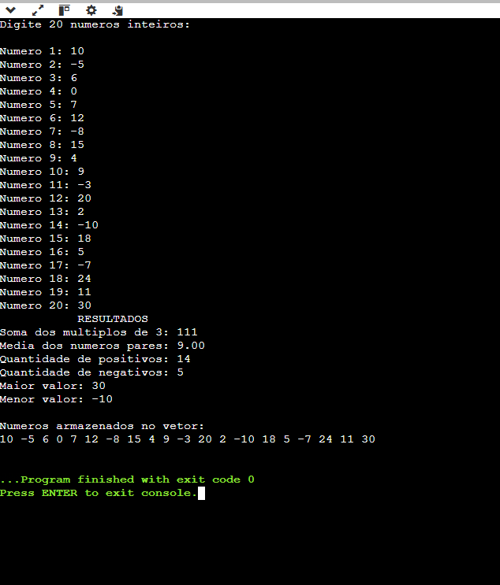

# Análise de Vetor de 20 Números

## 1. Identificação

**Aluno:** Bernardo Kopp Pinheiro  
**Disciplina:** Algoritmos e Pensamento Computacional  
**Título do projeto:** Análise de Vetor de 20 Números  

---

## 2. Objetivo

O objetivo desta atividade é desenvolver um programa em linguagem C para aplicar os conceitos de arrays (vetores), estruturas de repetição, estruturas condicionais, entrada de dados e operações matemáticas.

O programa realiza a leitura de 20 números inteiros, armazena os valores em um vetor e realiza diferentes análises sobre os elementos armazenados.

---

## 3. Funcionamento do programa

O programa utiliza um vetor de inteiros com 20 posições para armazenar os números informados pelo usuário.

Primeiramente, o programa solicita ao usuário 20 números inteiros e armazena cada valor em uma posição do vetor.

Após o preenchimento do vetor, o programa percorre os elementos para realizar os cálculos e verificações solicitados.

Durante essa análise, o programa:

- calcula a soma dos elementos múltiplos de 3;
- calcula a média dos elementos pares;
- conta a quantidade de números positivos;
- conta a quantidade de números negativos;
- identifica o maior valor armazenado;
- identifica o menor valor armazenado;
- apresenta todos os elementos armazenados no vetor.

O valor zero não é contabilizado como positivo ou negativo.

Para calcular a média dos números pares, o programa verifica primeiro se existe pelo menos um número par. Caso não exista nenhum número par, a divisão não é realizada, evitando uma divisão por zero.

---

## 4. Lógica utilizada

O vetor utilizado no programa possui 20 posições:

```c
int numeros[20];
```

Um primeiro laço de repetição é utilizado para solicitar os 20 números e armazená-los no vetor.

Depois, um segundo laço percorre todas as posições do vetor para realizar as verificações.

### Múltiplos de 3

Para verificar se um número é múltiplo de 3, é utilizado o operador de resto da divisão:

```c
if (numeros[i] % 3 == 0)
```

Quando o resultado do resto da divisão por 3 é igual a zero, o número é considerado múltiplo de 3 e seu valor é adicionado à soma.

### Números pares

A verificação dos números pares é realizada utilizando:

```c
if (numeros[i] % 2 == 0)
```

Quando o número é par, seu valor é adicionado à soma dos pares e a quantidade de números pares é incrementada.

A média é calculada somente quando existe pelo menos um número par.

### Números positivos e negativos

Os números positivos são identificados pela condição:

```c
if (numeros[i] > 0)
```

Os números negativos são identificados pela condição:

```c
if (numeros[i] < 0)
```

Dessa forma, o valor zero não é contabilizado em nenhuma das duas categorias.

### Maior e menor valor

O primeiro elemento do vetor é utilizado inicialmente como referência para o maior e o menor valor.

Em seguida, os demais elementos são comparados com essas referências.

Caso seja encontrado um valor maior, a variável `maior` é atualizada.

Caso seja encontrado um valor menor, a variável `menor` é atualizada.

---

## 5. Como executar

Para compilar o programa utilizando o GCC:

```bash
gcc vetor.c -o vetor
```

Para executar no Windows:

```bash
vetor.exe
```

Para executar no Linux ou macOS:

```bash
./vetor
```

Após iniciar o programa, basta informar os 20 números inteiros solicitados.

---

## 6. Exemplo de entrada

Um exemplo de entrada utilizada para testar o programa foi:

```text
10
-5
6
0
7
12
-8
15
4
9
-3
20
2
-10
18
5
-7
24
11
30
```

---

## 7. Exemplo de saída

Para os valores apresentados no exemplo de entrada, o programa apresenta:

```text
Soma dos multiplos de 3: 111
Media dos numeros pares: 8.60
Quantidade de numeros positivos: 13
Quantidade de numeros negativos: 5
Maior valor: 30
Menor valor: -10

Elementos armazenados no vetor:
10 -5 6 0 7 12 -8 15 4 9 -3 20 2 -10 18 5 -7 24 11 30
```

---

## 8. Evidência da execução

A captura de tela abaixo apresenta a execução do programa e os resultados obtidos após a entrada dos 20 números.



---

## 9. Estrutura do projeto

O repositório está organizado da seguinte forma:

```text
atividade-vetor/
│
├── vetor.c
├── README.md
└── evidencia.png
```

O arquivo `vetor.c` contém o código-fonte do programa.

O arquivo `README.md` contém a documentação da atividade.

O arquivo `evidencia.png` contém a captura de tela da execução do programa.

---

## 10. Considerações finais

A atividade permitiu aplicar os conceitos de vetores, estruturas de repetição, estruturas condicionais e operações matemáticas em linguagem C.

A utilização do vetor facilitou o armazenamento e a análise dos 20 números, permitindo que diferentes informações fossem obtidas a partir dos mesmos dados.

Também foi necessário utilizar uma condição específica para evitar a divisão por zero no cálculo da média quando não existem números pares.
